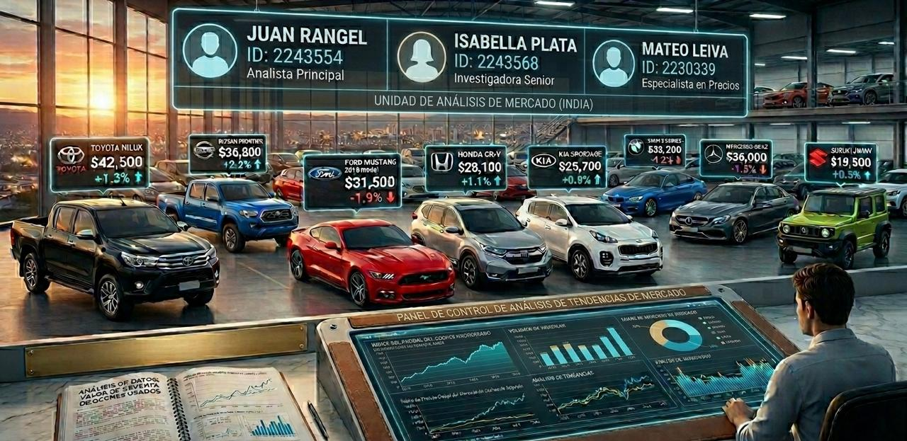

# Modelado y Segmentación de Vehículos Usados de la India

## Autores:

 - Juan José Rangel Camacho 
 - Isabella Plata Otero
 - Sebastián Mateo Leiva Lizarazo

## Objetivo
Desarrollar un pipeline predictivo con Machine Learning y Deep Learning para estimar precios de vehículos usados, integrando reducción de dimensionalidad y clustering para analizar la segmentación del mercado.

## Dataset 
https://www.kaggle.com/datasets/ayushparwal2026/cars-dataset

## Modelos
Decision Tree, Random Forest Regressor, SVR, Deep Learning, PCA, K-Means, DBSCAN

## Enlace del código
https://colab.research.google.com/drive/1h1fa4SRY7kc4oLRjS1Rf6u-X3fnFn98e?usp=sharing

## Enlace del video
https://youtu.be/vM4n8EwCKnM
